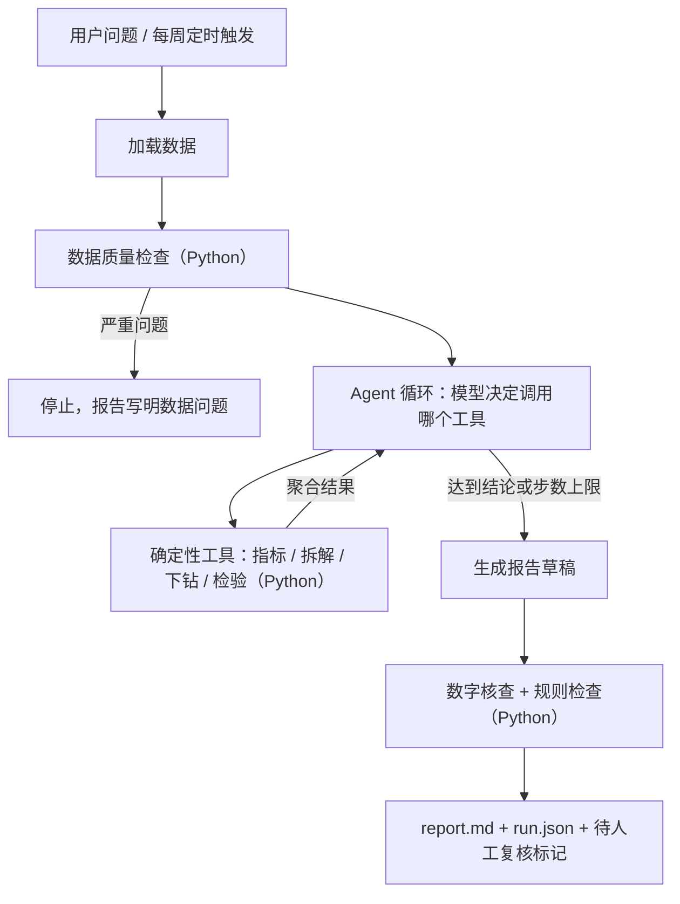

# 项目提示词：运营周报与指标异动分析 Agent

> 项目名：`da-agent`（data analysis agent）
> 用法：把本文件放在新仓库根目录。每次开新会话，对 AI 编程助手说：“先读 PROJECT_BRIEF.md，告诉我当前在哪个里程碑，然后只做这一个。”
> 灵感来源：[li-xiu-qi/data_analysis_agent](https://github.com/li-xiu-qi/data_analysis_agent)（MIT）的“自然语言需求 → 分析 → 报告”工作流。本项目从零实现，不复制其代码；README 致谢里写明。

---

## 1. 给 AI 助手的协作规则（必须遵守）

1. **一次只做一个里程碑**（见第 13 节）。开始前先用中文列出计划、要新建或修改的文件，等用户说“可以”再动手。做完后停下，不自动进入下一个里程碑。
2. **用户要能讲清每一行代码。** 讲解用中文；必须用英文术语时，后面紧跟一句简单的中文解释。先讲“最简单怎么理解”，再讲细节。优先写短小、直白的代码，不引入用户讲不清的抽象。
3. **不编造。** 数据、指标、评测结果、耗时、费用，都必须来自实际运行的输出。没跑过的就写“未测”。
4. **关键数字由 Python 计算。** 模型只负责选工具、解读结果、组织语言。
5. **密钥绝不进入 git。** 不把 API Key 写进代码、日志、报告、提交记录或 issue。
6. **不擅自对外操作。** 推送代码、启用定时任务、发送飞书或邮件、调用付费模型之前，都要先问用户。
7. **每个里程碑结束时交付三样东西：**
   - 改动摘要和测试结果；
   - “面试可以这样讲”，3 句话；
   - 2 个理解检查问题，让用户回答。
8. 所有文件读写都显式写 `encoding="utf-8"`；所有函数加 type hints（类型标注）；日志用 `logging`，不用 `print`。

---

## 2. 项目一句话

**给一份运营数据和一个业务问题（例如“上周 GMV 为什么下降？”），Agent 自动完成数据检查、指标计算、异动归因，产出一份每个数字都可核查的中文分析报告。GitHub Actions 每周自动生成一份运营周报。**

目标用户场景：运营或数分同学每周一写周报。过去要手工拉数、做透视表、找原因、写结论；现在由 Agent 先产出初稿，人只负责复核和补充业务判断。

---

## 3. 目标

### 3.1 功能目标

- **F1 数据质量检查**：缺失、重复、异常值、口径问题（如退货单、负数量），输出每条规则影响了多少行。
- **F2 指标计算**：GMV、订单数、活跃客户数、客单价、人均订单数、复购率、退货率；支持周环比和同比。
- **F3 指标拆解**：GMV = 活跃客户数 × 人均订单数 × 客单价，用连环替代法算出每个因子对变化的贡献。
- **F4 维度下钻归因**：按国家、新老客、商品等维度，计算每个分组对总变化的贡献，并排序。
- **F5 实验分析**：两组对比的显著性检验、置信区间、最小样本量。仅用于合成数据里的模拟活动，因为公开数据没有实验。
- **F6 Agent 问答**：用户用自然语言提问，模型在循环里选择调用上面的工具，最后写报告。
- **F7 自动周报**：GitHub Actions 每周运行一次，生成周报并保存。
- **F8 报告数字核查**：报告里出现的每个数字，都必须能在工具输出里找到，否则标红。

### 3.2 产出目标（简历和面试用，全部要真实测出来）

| 产出 | 怎么得到 |
|---|---|
| 评测准确率：Agent 对比“无工具直接问模型”的基线 | 第 12 节评测集，两种方式各跑一遍 |
| 归因命中率 | 合成数据里注入已知异动，看 Agent 能否找对原因 |
| 数字核查通过率、越界次数 | F8 自动统计 |
| 单份报告的平均 token 数、耗时 | 运行记录自动汇总 |
| 周报提效 | 用户手工做一份同样的周报并计时，和自动生成对比。**如实写明样本只有 1 次** |
| 测试数量与 CI 状态 | GitHub Actions 徽章 |

---

## 4. 非目标（明确不做）

- 不做通用 BI 平台，不做前端大屏。第一版只有命令行加 Markdown 报告；Streamlit 界面放在“可选扩展”。
- 不让模型任意执行 Python 代码，只能调用预先写好的工具（原因见第 6 节）。
- 主流程不依赖 LangChain / LangGraph 等框架。Agent 循环自己写，约 150 行，方便讲清原理。LangGraph 只出现在 M3b 的对照示例里。
- 不做因果结论：没有对照实验时，只能写“相关”或“可能原因”。
- 不处理真实公司数据或个人隐私数据。

---

## 5. 工作流



每一步的输入和输出：

| 步骤 | 输入 | 输出 |
|---|---|---|
| 加载 | 原始数据文件 | 清洗后的表（DuckDB 或 parquet） |
| 质量检查 | 清洗后的表 | `quality.json`：每条规则的命中行数、严重级别 |
| Agent 循环 | 问题 + 质量摘要 + 工具说明 | 工具调用序列（参数和结果都记录） |
| 工具 | 参数（时间段、指标、维度） | 聚合后的数字表，**不含单个客户明细** |
| 报告 | 工具结果 | 中文报告：结论 → 主要原因 → 证据 → 局限 → 建议下一步 |
| 核查 | 报告和工具结果 | `checks.json`：未能对上的数字、越界表述 |

---

## 6. 架构与技术选型（每一条都要能在面试里讲出理由）

| 选择 | 理由 |
|---|---|
| Python 3.13 + `uv` 管理依赖 | 现代、快，锁文件保证在别人电脑上可复现 |
| DuckDB | 直接用 SQL 查 CSV 或 parquet，不用装数据库；能展示 SQL 能力 |
| **工具调用（function calling），而不是让模型写代码执行** | 原项目让模型写任意代码再执行，安全和正确性都难保证。改成模型只能调用写好的工具：数字来自经过测试的函数，每个工具都能单独写单元测试 |
| OpenAI 兼容接口，默认 MiniMax | 换服务商只改配置。MiniMax 官方文档确认 OpenAI 兼容接口支持 `tools`；多轮调用需把含 `tool_calls` 的完整 assistant 消息放回历史；M3 系列的思考内容可能以 `<think>` 标签出现在 `content` 里，需要剥离 |
| pydantic | 规定工具参数和报告结构的格式，模型返回错误格式时直接拒收 |
| 自写 Agent 循环 | 能讲清 Agent 的本质：模型在循环里“看结果 → 决定下一步 → 调工具”，直到完成或达到步数上限 |
| 离线假模型（fake LLM） | 没有 API Key 也能跑 demo 和 CI：用录制好的模型回复回放 |
| 可选的只读 SQL 工具 | 模型可以写 `SELECT` 查询。程序限制只读、限制返回行数、设超时 |

---

## 7. 工具清单（确定性函数，全部要有单元测试）

| 工具 | 作用 | 关键参数 |
|---|---|---|
| `data_quality_report` | 质量检查摘要 | 时间范围 |
| `metric_summary` | 指定周期的核心指标、环比、同比 | 周期、指标列表 |
| `decompose_gmv` | 连环替代法拆解 GMV 变化 | 基期、当期 |
| `drilldown` | 按维度计算各分组对变化的贡献，并排序 | 指标、维度、基期、当期、top_n |
| `mix_vs_rate` | 比率类指标的变化拆成“结构变化”和“组内变化”，用来识别辛普森悖论（整体和分组趋势相反的现象）。可选扩展 | 指标、维度 |
| `ab_test` | 两组比例或均值检验，给出 p 值、置信区间、样本量是否足够 | 组别列、指标 |
| `run_sql`（可选） | 只读查询 | SQL 语句 |

每个工具的返回值都必须带上：`period`（时间范围）、`sample_size`（样本量）、`definition`（口径说明）。

---

## 8. 边界与安全

- **数据最小化**：发给模型的只有聚合结果，不发送客户 ID 或逐行明细。面试可以讲：“真实信贷或运营数据有隐私要求，这个设计可以直接迁移。”
- **数字只能来自工具**：F8 核查报告里的每个数字。对不上的数字标红，并计入越界次数。
- **样本量门槛**：分组样本低于阈值（默认 30，可配置）时，工具返回“样本不足”，模型不得据此下结论。
- **因果措辞**：没有对照实验时，禁止用“导致”“因为”这类确定性因果表述。规则检查会扫描这类词并提示。
- **成本上限**：每次运行设置最多工具调用次数（默认 15，M7b 加入 calculate 后从 12 调高，与评测一致）和最多 token 数。超出就停止，并在报告里写明。
- **人工复核**：报告顶部固定显示“AI 初稿，待人工复核”。周报不会自动发给任何人，除非用户配置了推送并明确开启。

---

## 9. API Key 与配置

- 本地：密钥写在 `.env` 文件里，并加入 `.gitignore`，不提交。
- 仓库里只提交 `.env.example`，写占位值：
  ```
  LLM_BASE_URL=https://api.minimax.cn/v1   # MiniMax 国内站 OpenAI 兼容地址（2026-09 官方文档）
  LLM_API_KEY=your-key-here
  LLM_MODEL=MiniMax-M3
  LLM_MAX_TOOL_CALLS=15
  FEISHU_WEBHOOK=            # 可选，留空表示不推送
  ```
- 代码用 `pydantic-settings` 读取配置。缺少密钥时，只允许使用 `--llm fake` 模式，并给出清楚的报错。
- 日志和运行记录里只记录模型名、token 用量和耗时，**不记录密钥**。
- GitHub Actions 里用仓库 Secrets（Settings → Secrets and variables → Actions）存 `LLM_API_KEY`，通过环境变量传入。
- 加一道提交前检查（pre-commit 或 CI 步骤），扫描是否误提交了疑似密钥。

---

## 10. GitHub Actions 部署（README 要写清楚）

两个工作流：

1. **`ci.yml`**：每次 push 或 PR 时运行。
   - 安装依赖，运行测试，用假模型跑一次 demo。
   - **不需要任何密钥。**
2. **`weekly-report.yml`**：每周一定时运行，也可以手动触发（workflow_dispatch）。
   - 用 Secrets 里的密钥调用真实模型，生成当周周报。
   - 产物上传为 Actions artifact，并提交到 `reports/` 目录。
   - 飞书推送放到后续版本，第一版只提交到仓库。

README 的“部署”一节必须包括：
- Fork 以后要配置哪些 Secrets；
- 如何启用 Actions，如何手动触发；
- 去哪里看周报产物；
- 大约的费用和调用次数（写实测值，没测就写“未测”）；
- 如何关闭定时任务。

---

## 11. 数据

### 11.1 主数据：UCI Online Retail II

- 来源：<https://archive.ics.uci.edu/dataset/502/online+retail+ii>
- 许可证：**CC BY 4.0**，允许改编和再发布，需要署名。README 里写明出处。
- 规模：1,067,371 条交易，时间 2009-12-01 至 2011-12-09，Excel 文件 43.5MB。以上来自 UCI 页面。
- 字段：发票号、商品编码、描述、数量、时间、单价、客户 ID、国家。**实际列名以文件为准**，M1 第一步先核对。
- 已知特点：
  - 发票号以 C 开头的是退货或取消单；
  - 有负数量、缺失客户 ID；
  - 圣诞季波动很大。这正好可以用来讲“环比和同比的区别”。

### 11.2 合成数据：带“标准答案”的评测数据

写一个生成器，按固定随机种子生成数据，并**人为注入已知异动**。例如：“第 8 周德国市场老客的客单价下降 25%”，或者“第 12 周做了一次随机分组的优惠活动，实验组转化率提升 2 个百分点”。

因为我们知道正确答案，所以可以客观地评测 Agent 找得对不对。

### 11.3 “每周定时跑”怎么有意义：回放

公开数据是静态的，每周重复分析同一份数据没有意义。解决办法是**回放**：
- 仓库里用 `state/replay_cursor.json` 记录“当前模拟到第几周”；
- 每次定时运行，分析下一周对比上一周；
- 数据约 105 周，足够连续回放两年。

README 必须写明这是模拟上线，不是实时业务数据。

---

## 12. 评测（Eval）

- **题集**：约 20 题。
  - 12 题用合成数据，有注入的标准答案；
  - 8 题用 Online Retail II，参考答案由 Python 预先算出；
  - 其中至少 3 题故意设计成“数据不足，应该拒答”。
- **对比两种方式**：
  - 基线：把数据摘要一次性交给模型，直接回答，不给工具；
  - Agent：本项目的完整流程。
- **指标**：
  - 关键数字准确率（允许的误差提前定好）；
  - 归因 Top-1 和 Top-3 命中率；
  - 正确拒答率；
  - 数字核查失败次数；
  - 平均 token 和耗时。
- **结果如实记录**。结果不好也要写，并分析原因。先用 3 道题小规模试跑，确认费用可控，再全量跑。
- 每次评测都记录：模型名、prompt 版本（git 提交号）、temperature（随机性参数）、运行时间。

---

## 13. 里程碑（每个都要停下，等用户确认后才继续）

| 里程碑 | 交付物 | 验收标准 | 用户要能讲清 |
|---|---|---|---|
| **M0 骨架** | uv 项目、目录结构、`.env.example`、配置读取、假模型、`ci.yml` | 没有密钥也能 `uv run pytest` 通过，CI 为绿色 | 为什么密钥不能进仓库；CI 在做什么 |
| **M1 数据层** | 下载和加载脚本、清洗规则、`quality.json` | 每条清洗规则都有影响行数，并有测试 | 每条清洗规则的理由；删掉的数据会不会造成偏差 |
| **M2 分析工具** | 第 7 节的工具和单元测试（用手算的小例子） | 连环替代法的各因子贡献加总等于总变化 | 连环替代法怎么算、它的局限（替代顺序会影响结果） |
| **M3 Agent 循环** | 工具调用循环、步数上限、错误处理、运行记录 `run.json` | 假模型下走通完整流程；工具报错时不崩溃 | Agent 到底是什么；function calling 是怎么工作的 |
| **M3b LangGraph 对照**（可选，M3 之后） | `examples/langgraph_version.py`：用 LangGraph 实现同一个循环 | 同一份假模型脚本下，两个版本的工具调用顺序和最终结果一致；对比代码量 | 框架替我做了什么（状态管理、循环、工具节点），代价是什么（抽象层、版本变化、调试难度） |
| **M4 报告与核查** | 报告模板、数字核查、因果措辞检查 | 故意写错一个数字，核查能抓到 | 为什么要做数字核查；它能查什么、查不了什么 |
| **M5 电商分析流程（Skill）** | `skills/ecommerce-metric-diagnosis/SKILL.md`、`load_skill` 工具、流程检查、危险信号提醒 | 加载流程后必做工具都被调用；未照做时报告里能看到 | 什么是 Skill、为什么按需加载；流程如何修正真实运行暴露的推理问题 |
| **M6 评测** | 合成数据生成器、题集（含两道真实陷阱题）、基线对比、“无流程/有流程”对比、结果表 | 结果表里的每个数都能从评测输出复现 | 为什么要有基线；评测没覆盖到什么 |
| **M7 自动化** | `weekly-report.yml`、回放游标、README 部署说明 | 手动触发一次成功，产物可以下载 | 定时任务的回放设计；Secrets 怎么用 |
| **M7b 准确率提升** | ① `calculate` 计算工具；② 核查反馈修正（发现找不到出处的数字，退回模型改一次）；③ 日均指标 | 用 M6 同一题集重跑并对比；另写 5 道新题做留出检验，防止只针对原题集调优 | 为什么按失败原因分类后对症改进；为什么需要留出题；验证器反馈循环是什么 |
| **M8 面试材料** | README 结果表、架构图、1 分钟讲稿、10 个常见问答 | 用户能脱稿讲完 | 整个项目 |
| **M9 上市公司财报分析** | SEC 年报数据层（关键科目表带出处）、4 个财报工具、分析流程（Skill）、`company-ask`、8 道题的评测 | 真实运行 2 次，数字全部有出处；评测结果可复现 | 同一个 Agent 换领域只换工具、提示词和流程；真实数据里的口径陷阱怎么处理 |

---

## 14. 已知坑（提前处理）

- GitHub Actions 的 cron 用 **UTC 时间**，而且高峰期可能延迟触发。
- 公开仓库如果 60 天没有活动，GitHub 会自动停用定时工作流。自动提交的周报是否算作“活动”，需要实测确认。
- Actions 的 Ubuntu 环境**没有中文字体**，matplotlib 画出的中文会变成方块。需要在工作流里安装 `fonts-noto-cjk`，或者图表只用英文标签。
- 43.5MB 的原始数据**不提交到仓库**：在工作流里下载，用缓存加速，并校验文件指纹（SHA256）。
- 模型输出有随机性。评测时固定 temperature，CI 只使用录制好的回复。
- 从 fork 仓库发来的 PR **拿不到 Secrets**，这是正常的安全设计。

---

## 15. 已决定事项（2026-09-29）

| 事项 | 决定 |
|---|---|
| 项目名 | `da-agent` |
| 模型 | MiniMax（用户有 Token Plan 订阅）。默认 `MiniMax-M3`，地址 `https://api.minimax.cn/v1` |
| 周报去向 | 提交到仓库 `reports/`；飞书后续再加 |
| 仓库 | GitHub 公开仓库 |
| Python | 3.13（本机已有），`uv` 管理 |

### 待验证

- ~~Token Plan 订阅 Key 能否直接调用 OpenAI 兼容接口~~ **已验证可以**（2026-09-29，`da-agent doctor --ping` 发 1 次请求：`MiniMax-M3.1-Flash-Preview`，用时 1.26 秒，216 + 16 个 token）。
- Token Plan 额度受“5 小时固定窗口和周窗口”限制。评测一次跑 20 题时要控制并发和节奏。

### 仍待决定

0. **公司财报分析流程（2026-09-29 用户提出，主线完成后再做）**：电商流程已排入 M5。 公司相关已选定为“上市公司财报分析”：参照 CFA 财报分析六步框架、中诚信国际通用评级方法（业务风险 + 财务风险）、券商研报的财务分析与风险提示结构（不做估值与评级）；数据拟用 SEC EDGAR XBRL（阿里、京东、拼多多 + 亚马逊参照），杜邦分析复用 M2 的连环替代 + Shapley 引擎。~~待定：SEC 请求头联系邮箱~~ **2026-10-07 作为 M9 完成**：联系方式由用户写在 `.env` 的 `SEC_USER_AGENT`，不进仓库。
1. **评测提出的改进（2026-09-29，已排入 M7b）**：① 工具提供日均指标（W49 类错误，Agent 两组 4/4 失败）；② 确定性计算工具，让推导出的数字也有出处（Agent 22 次未通过中 18 次唯一原因是自行计算的数字）。均可用同一题集重跑做前后对比。**2026-10-07 已完成**：原题 9/20 → 18/20、9/20 → 20/20，留出题 6/10 → 10/10、5/10 → 8/10；提升主要来自核查后退回修正，token 约为原来的 1.9 倍。见 `eval/results/m7b-comparison.md`。
2. 是否加 Streamlit 简易界面（建议 M7 之后再考虑）。
2. 是否在 M5 之后加一个信贷场景的合成数据集（逾期率、分期转化）。
