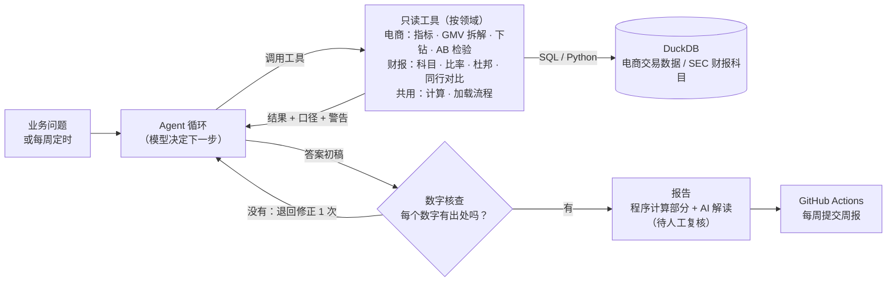
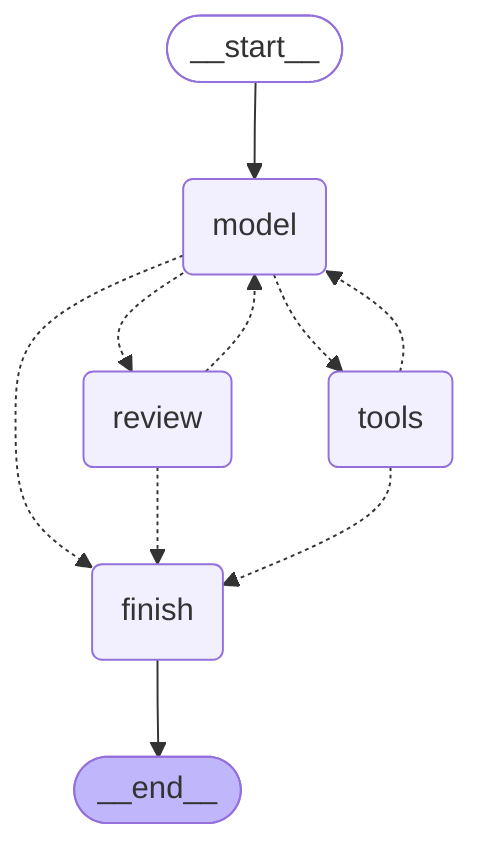

# da-agent

[](https://github.com/Eriksas/da-agent/actions/workflows/ci.yml)
[](https://github.com/Eriksas/da-agent/actions/workflows/weekly-report.yml)

**运营周报与指标异动分析 Agent。** 给一份运营数据和一个业务问题（如“上周 GMV 为什么下降？”），模型负责选择分析工具，Python 负责计算每一个数字，最终报告里的数字都能回查到工具输出。

> **项目网站**：<https://eriksas.github.io/da-agent/>（周报、评测、财报比率、运行回放，每周自动更新）
>
> 当前进度：**M7 自动周报**已上线，每周一由 GitHub Actions 生成一份，见 [reports/weekly](reports/weekly/README.md)；**M7b 准确率提升**已完成，前后对比见 [m7b-comparison.md](eval/results/m7b-comparison.md)；**M9 上市公司财报分析**已完成，同一个 Agent 换成财报领域，见[下文](#上市公司财报分析m9-产出)。完整规划见 [PROJECT_BRIEF.md](PROJECT_BRIEF.md)，**真实运行样例**见 [examples/real_runs](examples/real_runs/README.md)。

## 架构



- **模型只做判断，不做计算**：模型决定调用哪个工具、怎么解读；数字全部来自经过测试的 SQL 和 Python 函数，模型不能执行自己写的代码。
- **每个数字都能追溯**：程序逐个检查答案里的数字能否在工具输出里找到；找不到就退回模型修正一次，仍找不到的在报告里列出。
- **结论要人来定**：报告标注“AI 初稿，待人工复核”，并列出因果表述、警告和工具调用记录。

## 关键结果

全部来自仓库里的结果文件，每次运行的完整记录都已提交。模型 MiniMax-M3.1-Flash-Preview。

| 问题 | 结果 | 出处 |
|---|---|---|
| 工具有没有用？（10 道题） | 直接问模型通过 2/10，数字有出处率 51%；Agent 两组合计通过 18/40 | [M6 评测](eval/results/full-2026-09-29/summary.md) |
| 对症改进后（同 10 道题） | 18/40 → 38/40；只看初稿（不靠核查后退回修正）22/40 | [M7b 对比](eval/results/m7b-comparison.md) |
| 能不能推广？（5 道改代码前冻结的新题） | 11/20 → 18/20；只看初稿 9/20 | [M7b 对比](eval/results/m7b-comparison.md) |
| 代价 | 每次运行 token 约为原来的 1.9 倍 | [M7b 对比](eval/results/m7b-comparison.md) |
| 自动周报 | 每周一运行；已生成的周报数字出处 122/129、119/119 | [reports/weekly](reports/weekly/README.md) |
| 换一个领域：上市公司财报（8 道题） | 直接问模型 4/8，数字有出处率 46%；Agent 16/16，只看初稿 9/16 | [M9 评测](eval/results/company-2026-10-07/summary.md) |
| 测试 | 214 个，每次 push 由 CI 运行 | [ci.yml](.github/workflows/ci.yml) |

提升主要来自“核查后退回修正”，它和评分用的是同一个核查器，所以“数字有出处”这一项的提升有一部分是构造出来的；局限和解读见 [M7b 对比](eval/results/m7b-comparison.md)。人工复核由 Claude 辅助完成，待项目作者确认。

## 进度

| 里程碑 | 内容 | 状态 |
|---|---|---|
| M0 | 项目骨架、配置、假模型、CI | ✅ |
| M1 | 数据加载与质量检查 | ✅ |
| M2 | 确定性分析工具（指标、GMV 拆解、维度下钻、实验检验） | ✅ |
| M3 | Agent 循环（工具调用） | ✅ |
| M3b | 用 LangGraph 重写同一循环做对照（可选） | ✅ |
| M4 | 报告与数字核查 | ✅ |
| M5 | 电商分析流程（Skill，按需加载 + 流程检查） | ✅ |
| M6 | 评测集与基线对比（含“无流程 / 有流程”对比） | ✅ |
| M7 | GitHub Actions 自动周报 | ✅ |
| M7b | 准确率提升（计算工具、核查后退回修正、日均指标，留出题检验） | ✅ |
| M8 | 面试材料（README 首屏：架构图、关键结果表） | ✅ |
| M9 | 上市公司财报分析（SEC 年报数据、4 个财报工具、分析流程、评测） | ✅ |
| M10 | 项目展示网站（GitHub Pages，静态网页，每周随周报更新） | ✅ |
| 之后 | 上市公司财报分析流程（可选） | 未开始 |

## 本地运行

需要 Python 3.13 和 [uv](https://docs.astral.sh/uv/)。

```bash
uv sync                          # 安装依赖
uv run da-agent doctor           # 查看配置状态（不调用模型，不打印密钥）
uv run da-agent demo             # 离线演示：假模型剧本在内置小样例上走完整个 Agent 循环，不需要密钥
uv run pytest                    # 运行测试

uv run da-agent prepare-data     # 从 UCI 下载数据（约 44MB）并转成 parquet，首次约需 3 分钟
uv run da-agent quality          # 生成数据质量报告 reports/data_quality.md
uv run da-agent week 2011-W48    # 不经过模型，输出某一周的指标、GMV 拆解和下钻（--compare yoy 为同比）

uv run da-agent doctor --ping    # 发 1 次真实请求，确认模型地址、名称和密钥可用
uv run da-agent ask "上周 GMV 为什么变化？"  # 用真实模型回答，运行记录、核查结果和报告存到 runs/
uv run da-agent check runs/<运行编号>        # 对已保存的运行补做核查、重新生成报告，不调用模型
uv run da-agent eval --repeats 2              # 评测：10 道题 × 3 个对比组，程序打分（约 200 次模型调用）
uv run da-agent eval --case-file eval/holdout.yaml --conditions agent,agent_skill  # 留出题（M7b）
uv run da-agent eval-rescore eval/results/<名称>  # 评分规则修改后，离线重新打分，不调用模型
uv run da-agent eval-compare eval/results/<改进前> eval/results/<改进后>  # 前后对比表，不调用模型
uv run da-agent build-site                    # 生成项目网站到 _site/（静态网页，不调用模型）
uv run da-agent weekly --llm fake --week 2010-W02 # 用假模型检查周报流程（输出在 runs/，不提交）

uv run da-agent fetch-financials              # 下载 SEC 财报数据，重新生成关键科目表（需要 SEC_USER_AGENT；表已提交，平时不用跑）
uv run da-agent company-ask "阿里巴巴最近一个财年的盈利能力怎么样？"  # 上市公司财报分析
uv run da-agent eval --case-file eval/company_cases.yaml --conditions baseline,agent_skill  # 财报评测
```

## 数据质量（M1 产出）

[数据质量报告](reports/data_quality.md)由 `da-agent quality` 生成，所有数字由 SQL 计算。清洗规则共 10 条，每条都写明理由、处理方式和影响行数，定义在 [cleaning.py](src/da_agent/cleaning.py)。探查中的主要发现：

- 原始文件的两个工作表时间重叠，重叠期记录逐行完全相同，直接拼接会重复计算。
- 非商品编码（运费、平台费、人工调整、测试记录、礼品卡）按业务含义逐个归类；格式特殊但确实是商品的编码予以保留。
- 缺客户 ID 的订单计入 GMV，但不计入客户类指标。
- 极端大额行进入人工复核清单，并自动识别“等量取消”和“人工调整冲销”两种冲销方式。
- 按完整周日历检查覆盖情况，标出不完整周和整周停业的周。

规则的正确性由两类测试保证：手算小样例（CI 中运行），以及用 pandas 独立重写规则、与 SQL 结果交叉核对（本地有数据时运行）。

## 分析工具（M2 产出）

Agent 在 M3 中调用的就是这些确定性函数，数字全部由 SQL 和 Python 计算：

| 工具 | 回答的问题 | 代码 |
|---|---|---|
| `metric_summary` | 某周的 GMV、订单、客单价、新老客、取消率等，与上周（环比）或去年同周（同比）比变了多少 | [metrics.py](src/da_agent/metrics.py) |
| `decompose_gmv` | GMV 的变化来自客户数、人均订单数还是客单价（连环替代法 + Shapley 分解） | [decompose.py](src/da_agent/decompose.py) |
| `drilldown` | 变化主要来自哪个国家、新客还是老客、哪个商品 | [metrics.py](src/da_agent/metrics.py) |
| `proportion_test` 等 | AB 实验的显著性、置信区间、所需样本量、样本比例失衡（SRM）检查 | [abtest.py](src/da_agent/abtest.py) |
| `calculate`（M7b） | 四则运算：求和、相减、占比、变化率、日均。让推导出的数字也有出处 | [calculator.py](src/da_agent/calculator.py) |

设计要点：

- **每个结果自带口径和警告**：不完整周、整周停业、节假日、新老客划分的左删失、含极端大额订单的周，都会在结果里写明。例如 2011-W49 的 GMV 环比大幅上涨、净销售额却几乎不变，工具会提示这一周不完整，且含一笔当天被取消的超大订单。
- **比率类指标只报百分点变化**，不报容易误读的“变化百分比”。
- **连环替代法的顺序问题**：同时给出默认顺序的结果、6 种顺序的范围，以及与顺序无关的 Shapley 分解。
- **工具会拒绝不成立的计算**：例如基期整周停业时不做拆解，同比找不到对应的周时直接报错。

测试：手算小样例覆盖每个工具；AB 检验另用 scipy 原始数据检验对照、用蒙特卡洛模拟验证样本量公式；真实数据上检查恒等式（各周之和等于总数、每周拆解之和等于总变化）。

## Agent 循环（M3 产出）

Agent 就是一个循环：把问题和工具说明书发给模型 → 模型回复“请调用某个工具” → 程序执行工具、把结果放回对话 → 再发给模型……直到模型不再要工具、直接作答。模型负责决定下一步做什么，程序负责执行和约束。代码见 [agent.py](src/da_agent/agent.py)、[tools.py](src/da_agent/tools.py)、[llm.py](src/da_agent/llm.py)，系统提示词见 [prompts/agent_system.md](prompts/agent_system.md)。

- **工具只读**：工具只查询和计算，不能改数据、不能写文件，也不能执行模型生成的代码（M7b 加入的 `calculate` 只接受四则运算，先解析语法树再逐个检查，不用 `eval`）。
- **参数先校验**：参数格式用 pydantic 定义，同一份定义生成给模型看的说明书，也在执行前校验。参数不合法、工具拒绝计算、工具内部出错，都会把原因交还给模型，让它改正或说明，程序不会崩溃。
- **四道闸**：工具调用次数上限；轮数上限；模型发出的每个工具请求都有对应回复（接口要求）；模型调用失败时以明确状态结束。
- **运行记录**：每次运行在 `runs/` 下保存完整对话（`run.json`）和答案（`answer.md`），可以逐步复盘，不含密钥。
- **模型接入**：OpenAI 兼容接口，默认 MiniMax。推理模型夹在正文里的思考过程会从答案中剥离，但在对话历史里原样保留，以保证多轮推理连贯。

测试全部使用假模型，覆盖各种“不按剧本走”的情况：参数写错后改正、调用不存在的工具、超出次数上限、模型一直要工具、模型调用失败、空答案。

## 报告与核查（M4 产出）

首批两次真实运行显示：模型没有编造数字，但会用对的数字推出错的结论（见[样例](examples/real_runs/README.md)）。所以报告分三层把关，代码见 [checks.py](src/da_agent/checks.py)、[report.py](src/da_agent/report.py)：

1. **数字自动核查**：报告里的每个数字，都要能在本次运行的工具输出（或用户问题）里找到。能识别百分比、百分点、“万”、千分位和正负号，按显示精度定容差。
2. **措辞标记**：标出因果表述（导致、因为……）和绝对化或无依据的推测（全靠、更可能……），只标记、不拦截。
3. **人工复核**：报告顶部固定标注“AI 初稿，待人工复核”，附录列出找不到出处的数字、需复核的表述、工具调用记录和全部警告，让复核的人知道该看哪里。

`da-agent check` 可以对旧的运行记录补做核查；有找不到出处的数字时退出码为 1，可在自动化流程中当作关卡。

局限（也写在测试里）：
- 只要某个数在工具输出里出现过就算“有出处”，所以查不出“数字被安在了错误的指标上”。反向检验中，把示例数据的剧本放到真实数据上回放，12 个编造的数字抓到 7 个，其余 5 个是 0.0、5.0、30 这类常见数字，碰巧在工具输出里也出现过。
- ≤ 10 的整数（如“5 天”）不核查，单独计数。
- 推理是否成立无法自动判断。样例中最严重的一处错误（把“前 5 名以外”当成“剔除大单后”，结论方向相反）没有被任何规则标出。

## 分析流程（M5 产出）

把资深数据分析师的做法写成流程手册，模型按需加载、照着执行，程序检查它有没有照做。流程见 [skills/ecommerce-metric-diagnosis/SKILL.md](skills/ecommerce-metric-diagnosis/SKILL.md)，代码见 [skills.py](src/da_agent/skills.py)。

- **格式**：遵循 [Agent Skills 规范](https://agentskills.io/specification)，一个文件夹一个 `SKILL.md`，开头写名字和“何时使用、何时不用”。
- **按需加载**：系统提示词里只放一行目录；模型判断需要时调用 `load_skill` 取回正文。流程再多也不会把上下文塞满，改流程不用改代码。
- **内容来自真实失误**：陷阱清单里的每一条（不完整周期比较、极端值、忽略抵消项、口径偷换……）都配有“在这份数据里的样子”，大多来自首批真实运行中模型犯过的错。结论要求区分数据事实、推断和待验证假设，并给出可信度自评。
- **程序检查**：报告附录列出加载了哪个流程、必做步骤是否完成；核心指标变化超过 50% 时提示复核者先排查数据问题。

设计参考了 Anthropic 开源的分析类技能（均为 Apache-2.0）：[knowledge-work-plugins](https://github.com/anthropics/knowledge-work-plugins) 的 `analyze`（问题分级）、`validate-data`（陷阱清单、危险信号、可信度三级评定）、`variance-analysis`（驱动因素写法与反模式），以及 [financial-services](https://github.com/anthropics/financial-services) 的 `earnings-analysis`、`comps-analysis`（出处标注、指标选择）。流程内容为本项目自行编写，并有意没有照搬两点：不要求模型解释因果（我们的数据只能说明发生了什么），不做估值与投资判断。

## 配置模型（可选）

默认使用 MiniMax 的 OpenAI 兼容接口。复制 `.env.example` 为 `.env`，填入自己的 `LLM_API_KEY`。

- `.env` 已被 `.gitignore` 忽略，**不会被提交**。
- 代码只从环境变量或 `.env` 读取密钥，日志和报告里只显示“已配置/未配置”。
- CI 每次运行都会扫描仓库，发现疑似密钥会直接失败。


## 评测（M6 产出）

同一批题目，三种做法各跑一遍，由程序打分，再对陷阱题做人工复核。2026-09-29 用 MiniMax-M3.1-Flash-Preview 跑了 10 道题、50 次运行（Agent 两组每题 2 次）。结果：[summary.md](eval/results/full-2026-09-29/summary.md)，评分规则：[cases.yaml](eval/cases.yaml)，人工复核：[human_review.json](eval/results/full-2026-09-29/human_review.json)，每次运行的完整记录都在同目录的 `runs/` 下。

| 组别 | 自动通过 | 要点命中率 | 数字有出处率 | 陷阱题人工判断通过 | 平均 token | 平均用时 |
|---|---:|---:|---:|---:|---:|---:|
| 直接问模型（只给周度指标表） | 2/10 | 79% | 51% | 3/5 | 8,141 | 63.1 秒 |
| Agent 不带流程 | 9/20 | 100% | 98% | 8/10 | 16,165 | 21.1 秒 |
| Agent 带流程 | 9/20 | 100% | 99% | 8/10 | 20,884 | 27.5 秒 |

主要发现（数字均来自上面的结果文件）：

- **工具的价值**：直接问模型只能看到周度总表，回答不了“哪个国家拖累”“荷兰为什么跌”，也没有发现新客在数据起点附近会被高估。
- **分析流程没有带来可测量的提升**：两组通过率相同，陷阱题人工判断也相同，带流程多花约 29% 的 token 和 30% 的时间。流程的作用目前主要体现在可审计（能检查模型是否按步骤执行），不能写成“提升了准确率”。
- **最顽固的错误在 W49**：Agent 两组 4 次运行全部用不可比的总量得出“业务下滑”（其中 2 次重复了“把前 N 名以外当成剔除大单后”的老错误），流程里的警告没能阻止；直接问模型组反而自己按日均折算，处理对了。原因是 Agent 被要求不自行计算，而工具没有提供日均指标——问题在工具，不在流程。
- **自动评分的主要失败原因是自行计算的数字**：Agent 两组 22 次未通过中，18 次的唯一原因是有数字找不到出处，其中多数是算对了的推导数（例如样本比例 52.83%）。这是“可审计”和“灵活”之间的取舍。
- **评分器本身需要先验证**：试跑和正式评测后各发现 4 处评分缺陷（记法、同义词、误伤正确的条件句、换一种说法就漏判），修正后离线重评，原结果保留（`summary.original.md`）。校准前，自动评分与人工在陷阱题上一致 20/25，其中 4 份是“自动判通过、实际犯了错”；校准后 25/25，但校准用的正是这批答案，这个数偏高。

局限：只有 10 道题、每组 2 次、单一模型；关键词评分是近似的；人工复核由 Claude 辅助完成，待项目作者确认。

评测提出的两项改进（日均指标、确定性计算工具）已在 M7b 完成，见下一节。

## 准确率提升（M7b 产出）

M6 中 Agent 没通过的运行，大多是因为数字找不到出处（模型自己做了加减和占比），另有 W49 的推理错误。M7b 对症做了四件事：

1. **`calculate` 计算工具**：只做四则运算；算式的输入也要能在工具结果里找到，否则算出的数不算出处。
2. **核查后退回修正**：答案里有找不到出处的数字，程序把它们退回模型修正一次；修正失败时保留初稿。
3. **日均指标和“交易天数不同”警告**：以前 5 天对 6 天的银行假日周没有任何提示。
4. **几处小修**：AB 工具写明推导量、核查器忽略小节编号、周报里 AI 部分的标题降级。

为了防止只针对原题调优，另写了 5 道留出题，在改代码之前冻结并先跑出改进前成绩。完整对比和解读：[m7b-comparison.md](eval/results/m7b-comparison.md)。

| 通过次数 | Agent 不带流程 | Agent 带流程 |
|---|---:|---:|
| 原题（10 道）：改进前 → 改进后 | 9/20 → 18/20 | 9/20 → 20/20 |
| 其中不靠退回修正 | 10/20 | 12/20 |
| 留出题（5 道）：改进前 → 改进后 | 6/10 → 10/10 | 5/10 → 8/10 |
| 其中不靠退回修正 | 4/10 | 5/10 |

- **提升主要来自“核查后退回修正”**。修正用的就是评分用的核查器，所以“数字有出处”这一项的提升有一部分是构造出来的；只看初稿，成绩和改进前差不多。
- **不靠构造的改进**：W49 从 M6 的 4 次全错变为 3 次正确（4 次都用 `calculate` 算出剔除大单后环比 +1.90%）；留出题的三道陷阱改进后都通过；核查器拦下了 4 次输入找不到出处的计算。
- **代价**：每次运行的 token 约为原来的 1.9 倍（原题：16,165 → 30,286、20,884 → 38,729）。
- **剩下的问题**：W49 仍有 1 次用不完整周的总量下结论；留出题“带流程”组的 2 次失败，是模型把工具调用写成了一段文字、程序把它当成了答案。评测后已加防护，但没有重跑。

## LangGraph 对照（M3b 产出）

主流程的 Agent 循环是手写的（[agent.py](src/da_agent/agent.py)），没有用框架。为了回答“为什么不用 LangGraph”，用 LangGraph 把同一个循环重写了一遍（[langgraph_version.py](examples/langgraph_version.py)）：工具、数字核查、模型客户端都直接复用，换掉的只有控制流程——`while` 循环变成一张有 4 个节点的图。

**怎么证明两个版本一样**（[对照测试](tests/test_langgraph_version.py)）：12 个假模型剧本，覆盖正常回答、工具次数用完、核查后退回修正（成功、失败、修正时的工具次数）、格式错误的工具调用（重发一次、连续两次）、轮数上限、未知工具、模型报错、空回答和财报领域。每个剧本下，两个版本每一轮发给模型的内容、工具调用、完整对话、最终答案和状态都完全一致。另外故意把 LangGraph 版改坏 5 处，每一处都有对应的剧本报警。

**对比**（由 [compare_langgraph.py](examples/compare_langgraph.py) 现算，耗时和机器有关）：

| 对比项 | 手写循环 | LangGraph 版 |
|---|---:|---:|
| 控制流程的代码行数（不含空行、注释、文档字符串） | 67 | 113 |
| 额外依赖的包（按 uv.lock 计） | 0 | 25 |
| 额外导入时间（新进程导入 langgraph.graph，中位数） | — | 1.75 秒 |
| 跑一次演示剧本（假模型，中位数） | 87.9 毫秒 | 97.8 毫秒 |

LangGraph 根据代码自动画出的流程图：



**结论**：
- 在这个规模下手写更合适：代码更短，不多出 25 个依赖和 1.75 秒的导入时间，出错时调用栈里也只有自己的代码。
- LangGraph 的好处是把流程画成了图，每个节点只管一件事，状态的合并方式（追加还是覆盖）写在类型里。它还自带这个项目没用到的能力：断点续跑、人工审批时暂停、并行分支、流式输出。
- 如果以后要加“人工确认后再发布周报”或者多个 Agent 协作，再迁移的成本不高：工具、核查和流程手册都能原样复用，这次的对照已经证明了这一点。

LangGraph 是可选依赖组（`uv sync --group langgraph`），只有 CI 的对照测试安装它，主流程和每周周报都不依赖它。

## 上市公司财报分析（M9 产出）

同一个 Agent 循环换一个领域：只换工具、系统提示词和分析流程，数字核查、退回修正和 `calculate` 原样复用。问“阿里巴巴最近一个财年的盈利能力怎么样、变化来自哪里”，Agent 用财报工具算数，按流程写结论。只做财务分析和风险提示，**不做估值、评级，不构成投资建议**。

- **数据**：SEC EDGAR 的 XBRL 年报数据（美国证监会公开数据，公共领域），阿里巴巴、京东、拼多多，加亚马逊作参照。整理后的[关键科目表](data/financials/README.md)提交在仓库里，每个数字都带出处（报表类型、文件编号、提交日期）。代码见 [financials.py](src/da_agent/financials.py)。
- **真实数据里的坑**（都写在测试里）：
  - 同一个数字在多份年报里重复出现：取最新提交的那份，重述后的数字会覆盖旧数字；
  - 每条记录的 `fy` 是报表年度，不是数字所属的年度：财年要按期间结束日期判断；
  - 阿里财年截至 3 月 31 日；
  - 中概股报表里混有少量美元“便利换算”数字：只用编报币种；
  - 京东 2017 年起换了归母净利润的标注写法；亚马逊没有标注总负债，要用“负债和权益合计 − 股东权益”推出；
  - 公司用自定义科目标注的数字不在标准分类里（例如阿里、拼多多近年的资本开支），标为“未披露”，不当成 0。
- **4 个工具**（[company.py](src/da_agent/company.py)）：`company_overview`（公司、财年、币种、缺失科目）、`financial_summary`（科目、比率、同比，每个数带出处）、`dupont`（ROE = 净利率 × 周转率 × 权益乘数，复用 M2 的 Shapley 拆解）、`peer_compare`（跨公司只比比率，不比金额）。
- **分析流程**（[SKILL.md](skills/company-financial-analysis/SKILL.md)）：步骤参照 CFA 财报分析框架；分析维度借用中诚信国际通用评级方法的“业务风险 + 财务风险（盈利能力、资本结构、偿债能力）”结构，只借结构，不做评级；陷阱清单全部来自上面的真实数据问题。
- **首次真实运行发现的问题**：原始金额有 12–13 位，模型自己换算成“百万”，换算后的数字找不到出处。于是工具给每个金额加上“亿”的写法（核查器认识“亿”），核查器也不再把 SEC 文件编号当成数字。修复后的两次真实运行，数字出处分别为 100/100 和 102/102（[样例和复核](examples/real_runs/README.md)）。

**评测**（[结果](eval/results/company-2026-10-07/summary.md)，[题集](eval/company_cases.yaml)）：8 道题，覆盖查数、杜邦拆解、同行对比、财年不对齐、币种不同、未披露不等于 0、拒绝投资建议、拒答数据外的公司。

| 组别 | 通过 | 要点命中率 | 数字有出处率 | 平均 token | 平均用时（秒） |
|---|---:|---:|---:|---:|---:|
| 直接问模型（只给一张关键科目表，单位亿） | 4/8 | 90% | 46% | 5,656 | 22.3 |
| Agent 带流程 | 16/16（只看初稿 9/16） | 100% | 100% | 31,679 | 37.3 |

- 直接问模型组能答对大部分陷阱和拒答题，例如它也拒绝了投资建议，也指出了币种不同。它没通过的 4 道题，都是因为自己算的数字（比率或变化额）没有出处；杜邦拆解那道题还漏了周转率。抽查：它按平均权益算出的 FY2024 ROE 为 44.9%，与工具的 44.92% 一致。差别在于能不能追溯、拆解是否完整，而不是算错。
- 第一次评分后发现 5 处评分规则缺陷：4 处是正确答案用了同义词表里没有的说法，1 处是把答案里引用用户问题的话（“值得买入吗”）当成了违规。修正后重评，直接问模型组 1/8 → 4/8，Agent 组 15/16 → 16/16，重评前的结果保留在 `summary.original.md`。这些规则是按同一批答案校准的，分数会偏乐观。
- 局限：每题 Agent 组只跑 2 次、直接问模型组 1 次，单一模型，关键词评分是近似的；没有人工复核。

## 项目展示网站（M10 产出）

网址：<https://eriksas.github.io/da-agent/>。代码见 [site.py](src/da_agent/site.py)，发布流程见 [pages.yml](.github/workflows/pages.yml)。

- **只放静态网页**：GitHub Pages 只能托管静态文件，不能运行 Python，也不能安全地调用模型（密钥会暴露给所有访客）。所以网站展示的是已经产生的结果，不提供在线提问。
- **内容**：首页（项目介绍、架构图、关键结果）、自动周报（每周一份，带 GMV 环比图）、评测（改进前后、直接问模型对 Agent）、财报比率（四家公司的 ROE 小多图和比率表）、运行回放（真实运行时每一步调了什么工具、答案、核查结果和人工复核）。
- **数字从哪来**：全部来自仓库里已提交的结果文件，或者由分析工具在生成网页时现算；图表由 Python 直接画成 SVG。模型回答当作不可信文本，渲染前先转义，原始 HTML 不会进入网页。
- **什么时候更新**：推送到 main 时，以及每周周报工作流成功之后（机器人提交的推送不会触发其他工作流，所以用周报工作流的完成事件来触发）。
- **本地预览**：`uv run da-agent build-site` 后，用 `python -m http.server --directory _site` 打开。

启用（只需一次）：仓库 Settings → Pages → Build and deployment → Source 选 **GitHub Actions**。

## 部署到 GitHub Actions（M7）

- **CI**（[ci.yml](.github/workflows/ci.yml)）：每次 push 自动运行测试和假模型示例，不需要密钥。
- **自动周报**（[weekly-report.yml](.github/workflows/weekly-report.yml)）：每周一北京时间 09:00 运行，准备数据（有缓存）→ 按回放游标生成下一周的周报 → 提交到 [reports/weekly](reports/weekly/) 并把游标推进一周。

周报分两部分：第一部分（指标、GMV 拆解、下钻、警告）由程序直接计算；第二部分是 AI 解读，开头附自动核查结果，标注“待人工复核”。模型调用失败时，第一部分照常发布。

**启用步骤：**

1. 仓库 Settings → Secrets and variables → Actions → New repository secret，名称 `LLM_API_KEY`，值为自己的模型 API Key。密钥只保存在 GitHub Secrets 中，不进入代码和日志。
2. 可选：在同一页的 Variables 中设置 `LLM_MODEL`、`LLM_BASE_URL`；不设置则使用默认值（MiniMax 国内站、`MiniMax-M3`）。
3. Actions → Weekly report → Run workflow：先选 `fake` 检查流程（不提交），再选 `real` 生成第一份周报。
4. 查看结果：[reports/weekly/README.md](reports/weekly/README.md) 是索引，每周一份报告，完整运行记录在 `reports/weekly/runs/<周>/`。

**说明：**

- 回放：[state/replay_cursor.json](state/replay_cursor.json) 记录下一次要分析的周，从 2010-W02 开始，跑完数据的最后一周（2011-W49）后自动停止。这是历史数据的模拟上线。
- 用量：每次运行调用模型几次。M6 评测中“Agent 带流程”组平均每题调用模型 3.6 次、约 2.1 万 token，可作参考。
- 停用：Actions 页面对该工作流选择 Disable workflow。
- 注意：定时任务按 UTC 计时，高峰期可能延迟（第一次定时运行比预定时间晚了约 5.5 小时）；公开仓库 60 天没有活动时，GitHub 会自动停用定时任务。来自 fork 的 PR 读不到 Secrets，这是 GitHub 的安全设计。
- 运行记录：2026-09-29 手动触发 `fake`（68 秒）和 `real`（86 秒）均成功，生成第一份周报 2010-W02；2026-10-05 第一次定时运行成功，生成 2010-W03。

## 数据与致谢

- 数据：[UCI Online Retail II](https://archive.ics.uci.edu/dataset/502/online+retail+ii)，许可证 CC BY 4.0。原始文件不提交到本仓库。
- 灵感来源：[li-xiu-qi/data_analysis_agent](https://github.com/li-xiu-qi/data_analysis_agent)（MIT）的“自然语言需求 → 分析 → 报告”工作流。本项目从零实现，架构不同：模型只能调用预先写好并经过测试的分析工具，不执行模型生成的代码。

## 许可证

[MIT](LICENSE)
